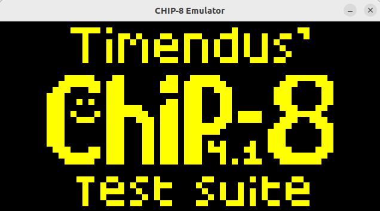
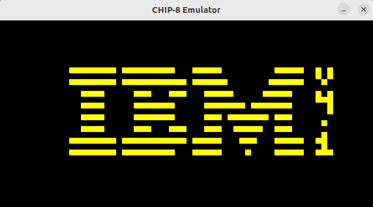
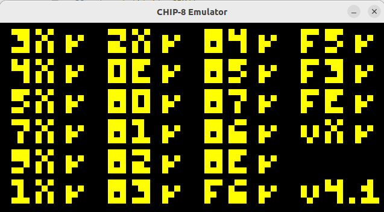
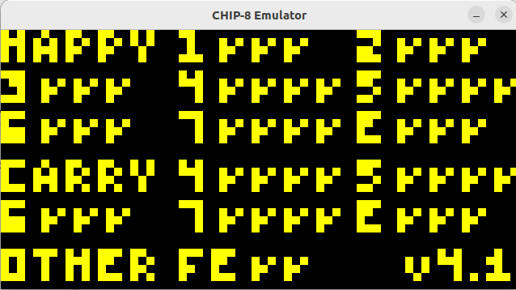

# CHIP-8 Emulator
An implementation of the Chip-8 Emulator (or to be precise, Intepreter) in C

# Overview
The CHIP-8 Emulator is a classic virtual machine designed to run programs written for the CHIP-8 instruction set. CHIP-8 is a simple interpreted language developed in the 70s for early microcomputers like the COSMAC VIP, offering a basic environment for creating simple games and applications. With a minimalist instruction set, basic graphics system, and simple sound capabilities, it was designed to be easy to program, making it popular among hobbyists and educators for learning about computer architecture and emulator development.

# Emulator Specifications
* 4 kilobytes of RAM
* Sixteen 8-bit general-purpose registers
* One 16-bit index register
* A stack with sixteen 16-bit values
* Two special registers: the program counter and the stack pointer
* A hexadecimal keypad with values 0 through F
* A monochrome display with a resolution of 64 x 32
* An 8-bit delay timer
* An 8-bit sound timer

# Test Outputs

# Requirements
* Linux
* C-11
* SDL2

# Usage
For Linux only
`./chip8 <path/to/file.ch8>`

# Resources
Website references:
* http://devernay.free.fr/hacks/chip8/C8TECH10.HTM

Repository references:
* https://github.com/f0lg0/CHIP-8 (Code Organization and Opcode Implementation)
* https://github.com/queso-fuego/chip8_emulator_c (SDL2 "How-to")

Social Media: - 
* /r/EmuDev [Reddit]
* Emulator Development [Discord] (Thanks, Janitor Raus and Gulrak!)
